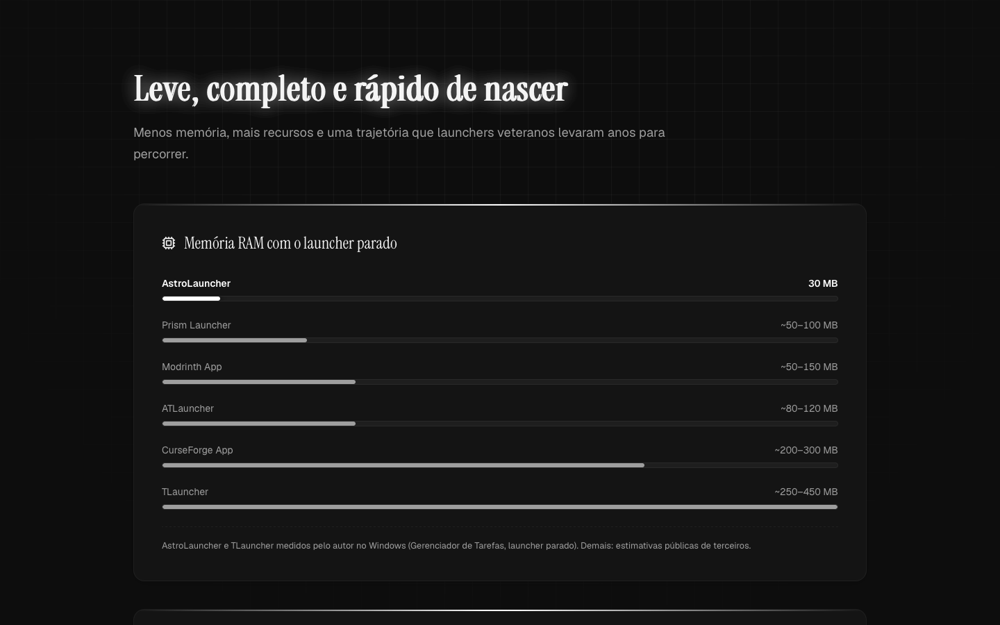
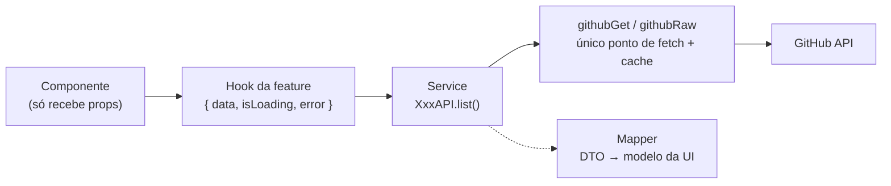

<p align="center">
  
</p>

<h1 align="center" style="border-bottom: 0;">AstroLauncher Web</h1>

<p align="center">
  Site oficial do <a href="https://github.com/kauafpssx/AstroLauncher">AstroLauncher</a>: React 19 + Vite + Tailwind CSS 4, com dados ao vivo da API do GitHub. 🌐
</p>

<!-- ══════════════ BADGES ══════════════ -->

<p align="center">
  
  
  
  
  
  
</p>

<p align="center">
  <a href="https://github.com/kauafpssx/AstroLauncher/releases/latest">
    
  </a>
</p>

## 📖 Índice

- [🚀 Sobre o projeto](#-sobre-o-projeto)
- [🖼️ Screenshots](#️-screenshots)
- [🧭 Seções do site](#-seções-do-site)
- [🧱 Stack de tecnologias](#-stack-de-tecnologias)
- [📐 Arquitetura](#-arquitetura)
- [📂 Estrutura do projeto](#-estrutura-do-projeto)
- [🔧 Desenvolvimento](#-desenvolvimento)
- [🎨 Identidade visual](#-identidade-visual)
- [🤝 Contribuindo](#-contribuindo)

## 🚀 Sobre o projeto

**AstroLauncher Web** é a landing page do [AstroLauncher](https://github.com/kauafpssx/AstroLauncher), o launcher de Minecraft feito em Rust + Tauri. O site apresenta o launcher, compara com os concorrentes e leva o visitante direto ao instalador certo para o sistema dele.

Tudo que muda com o tempo vem **ao vivo da API do GitHub**: versão atual, instaladores, commits, releases, downloads, linguagens e contribuidores. Nenhum número fica fixo no código, então uma release nova aparece sozinha no site.

> 🎯 **Objetivo:** mostrar em poucos segundos o que o AstroLauncher faz, por que ele é diferente e como baixar.

## 🖼️ Screenshots

| Hero e download por sistema | Comparativo de RAM                   |
| --------------------------- | ------------------------------------ |
|       |  |

## 🧭 Seções do site

|     | Seção                   | Descrição                                                                                                      |
| --- | ----------------------- | -------------------------------------------------------------------------------------------------------------- |
| 🪐  | **Hero**                | Logo, versão atual, botão **Baixar para o seu sistema** com menu de plataformas (Windows, macOS e Linux)       |
| ✨  | **Destaques**           | 15 funcionalidades principais do launcher, direto do README do AstroLauncher                                   |
| ⚖️  | **Comparativo**         | RAM com o launcher parado, tabela de recursos contra Prism, Modrinth, CurseForge, launcher oficial e TLauncher |
| 🔓  | **Código aberto**       | Por que código auditável importa, com fontes citadas                                                           |
| 🕰️  | **~40 dias vs 13 anos** | Linha do tempo arrastável com todas as releases, da v0.1.0 à mais recente                                      |
| 🦀  | **Stack**               | Tauri, React, Rust, SQLite, Cubiomes e shadcn/ui, mais a distribuição de linguagens do repositório             |
| 📊  | **Números**             | Commits, releases, downloads e contribuidores, com gráfico de commits por semana                               |
| 🤝  | **Contribua**           | Cards dos contribuidores e acesso ao guia de contribuição                                                      |
| 📄  | **Guia e Licença**      | Páginas internas que renderizam o `CONTRIBUTING.md` e a licença do launcher, com setinha para voltar           |

### 💡 Detalhes que fazem diferença

- **Download inteligente:** detecta o sistema pelo navegador e oferece o instalador certo; os outros ficam num menu com abas e o seu sistema marcado.
- **Tudo em PT-BR**, tema escuro fixo, igual ao launcher.
- **Animações discretas** com framer-motion, respeitando quem ativou _reduzir movimento_ no sistema.
- **Resiliente:** se a API do GitHub falhar ou bater o limite, os números somem com elegância e a página continua de pé.
- **Leve:** as páginas internas (guia e licença) carregam sob demanda, sem pesar na home.

## 🧱 Stack de tecnologias

<table>
<tr><td><b>⚛️ Frontend</b></td><td>

 React 19 &nbsp;
 TypeScript &nbsp;
 Vite 8 &nbsp;
 Tailwind CSS 4

</td></tr>
<tr><td><b>🎨 UI</b></td><td>

 &nbsp;
 lucide-react &nbsp;
 &nbsp;


</td></tr>
<tr><td><b>📝 Conteúdo</b></td><td>

 &nbsp;
 &nbsp;


</td></tr>
<tr><td><b>🔤 Fontes</b></td><td>

 &nbsp;


</td></tr>
<tr><td><b>🌐 Dados</b></td><td>

 GitHub REST API + raw.githubusercontent &nbsp;
cache em `sessionStorage` por sessão

</td></tr>
<tr><td><b>🧹 Qualidade</b></td><td>

 &nbsp;
 &nbsp;


</td></tr>
</table>

## 📐 Arquitetura

O site segue a mesma arquitetura **feature-first** e **componentizada** do front do AstroLauncher. Componente nunca chama `fetch` direto: o dado passa por camadas bem definidas, como o `apiInvoke` faz no launcher.



> 📐 **Regra fundamental:** componente só recebe props; busca de dados mora nos hooks, e todo acesso à rede passa por `src/lib/api/github-client.ts`.

| Camada                   | Responsabilidade                                               |
| ------------------------ | -------------------------------------------------------------- |
| 🧩 **components/ui**     | Primitivas (Button, Badge, Card) com variantes cva             |
| 🧱 **components/common** | Peças agnósticas: Section, Reveal, MarkdownBody, AnimatedLink  |
| 🗂️ **features/**         | Uma pasta por seção, com `components/`, `hooks/` e `services/` |
| 🔌 **lib/api**           | Cliente do GitHub com cache na sessão                          |
| 🔄 **lib/mappers**       | Funções puras que convertem DTOs do GitHub em modelos da UI    |
| 📦 **data/**             | Textos e conteúdo estático tipados, fora dos componentes       |

**Princípios:** peças pequenas que se compõem (filosofia LEGO), arquivos com no máximo 200 linhas, nada de `any` e nada de `utils.ts` genérico.

## 📂 Estrutura do projeto

<details>
<summary>🗃️ Clique para expandir a estrutura completa</summary>

```text
AstroLauncher-Web/
├── src/
│   ├── App.tsx                 # montagem das páginas + rotas por hash
│   ├── components/
│   │   ├── ui/                 #   primitivas (button, badge, card) + variants
│   │   ├── common/             #   Section, Reveal, MarkdownBody, alertas...
│   │   └── layout/             #   GridBackground, PageShell, Footer
│   ├── features/               # uma pasta por seção do site
│   │   ├── hero/               #   download por sistema, abas, ícones
│   │   ├── highlights/         #   destaques do launcher
│   │   ├── comparison/         #   RAM, tabela de recursos, linha do tempo
│   │   ├── stack/              #   stack + linguagens do repositório
│   │   ├── stats/              #   números e gráfico de commits
│   │   ├── contribute/         #   contribuidores
│   │   └── docs/               #   páginas de guia e licença
│   ├── lib/
│   │   ├── api/                #   githubGet / githubRaw com cache
│   │   ├── mappers/            #   DTO do GitHub → modelo da UI
│   │   ├── format.ts           #   números, datas e tamanhos em pt-BR
│   │   ├── hash-route.ts       #   rotas #/contribuir e #/licenca
│   │   └── platform.ts         #   detecção do sistema do visitante
│   ├── types/                  # DTOs do GitHub e modelos da UI
│   └── data/                   # conteúdo estático tipado
├── public/                     # logo e assets
└── docs/                       # screenshots deste README
```

</details>

## 🔧 Desenvolvimento

### ✅ Pré-requisitos

- [Node.js](https://nodejs.org) **20+**
- npm (o projeto usa `package-lock.json`)

### 🚀 Rodando localmente

```bash
# 1. Instala as dependências
npm install

# 2. Sobe o servidor de desenvolvimento
npm run dev

# 3. Gera a build de produção em dist/
npm run build
```

> [!TIP]
> Sem token, a API do GitHub permite **60 requisições por hora por IP**. O site guarda as respostas em `sessionStorage`, então recarregar a página não gasta a cota. Se ela acabar durante o desenvolvimento, os números viram `-` até a cota voltar.

### 📜 Scripts disponíveis

| Script                 | Descrição                                     |
| ---------------------- | --------------------------------------------- |
| `npm run dev`          | Servidor de desenvolvimento (Vite)            |
| `npm run build`        | Typecheck + build de produção                 |
| `npm run preview`      | Serve a build de produção localmente          |
| `npm run lint`         | ESLint em todo o código                       |
| `npm run format`       | Formata tudo com Prettier                     |
| `npm run format:check` | Confere a formatação sem alterar arquivos     |
| `npm run knip`         | Procura código, exports e dependências mortos |

> [!IMPORTANT]
> Antes de abrir um PR, rode `npm run lint`, `npm run build`, `npm run format:check` e `npm run knip`. Todos precisam passar.

## 🎨 Identidade visual

| Token        | Valor     | Uso                                     |
| ------------ | --------- | --------------------------------------- |
| `background` | `#0d0d0d` | fundo da página                         |
| `surface`    | `#141414` | cards, menus e botões secundários       |
| `foreground` | `#f4f4f4` | títulos e texto forte                   |
| `muted`      | `#9e9e9e` | corpo de texto e legendas               |
| `accent`     | `#ffffff` | destaque: botão Baixar, números, brilho |

- **Tipografia:** _Instrument Serif_ nos títulos e números, _Geist_ no texto e na interface.
- **Fundo:** grade de 40px com máscara radial e brilho suave nos títulos.
- **Tema:** escuro fixo, igual ao AstroLauncher.

## 🤝 Contribuindo

Contribuições são bem-vindas.

```bash
# 1. Faça um fork do repositório
# 2. Crie uma branch para sua mudança
git checkout -b feat/minha-mudanca

# 3. Faça suas mudanças e commit
git commit -m "feat: adiciona minha mudança"

# 4. Envie e abra um Pull Request
git push origin feat/minha-mudanca
```

> 💡 **Boas práticas do projeto:**
>
> - Arquivos com no máximo **200 linhas** (ideal 80 a 150)
> - Componentes sem `fetch`: dados sempre via hook → service → `githubGet`
> - Textos em **PT-BR**, identificadores de código em **inglês**
> - Nada de números inventados: todo dado do site tem fonte

<p align="center">
  Feito com 💜 no Brasil por <a href="http://instagram.com/kauafpss_">@kauafpss_</a>
</p>

<p align="center">
  <sub>🚀 Bora jogar?</sub>
</p>
